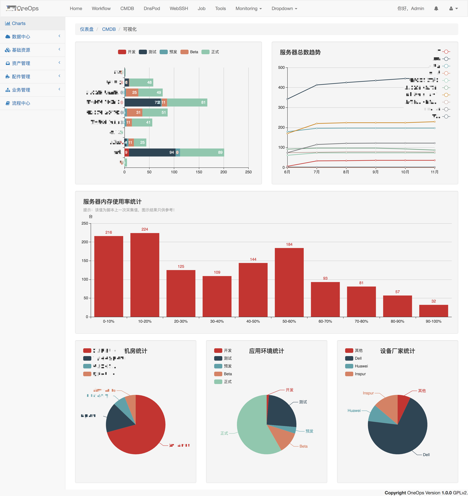
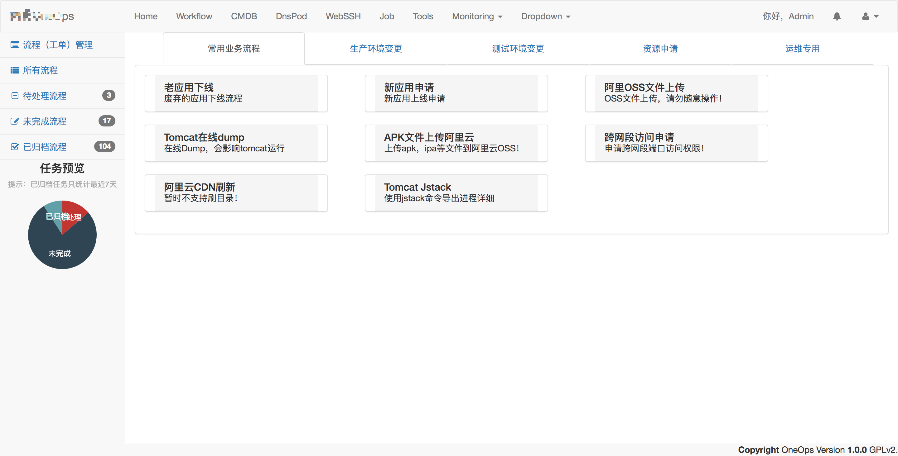
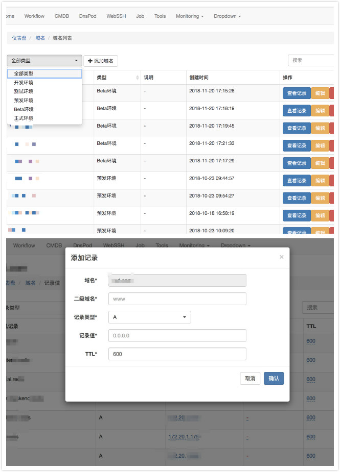
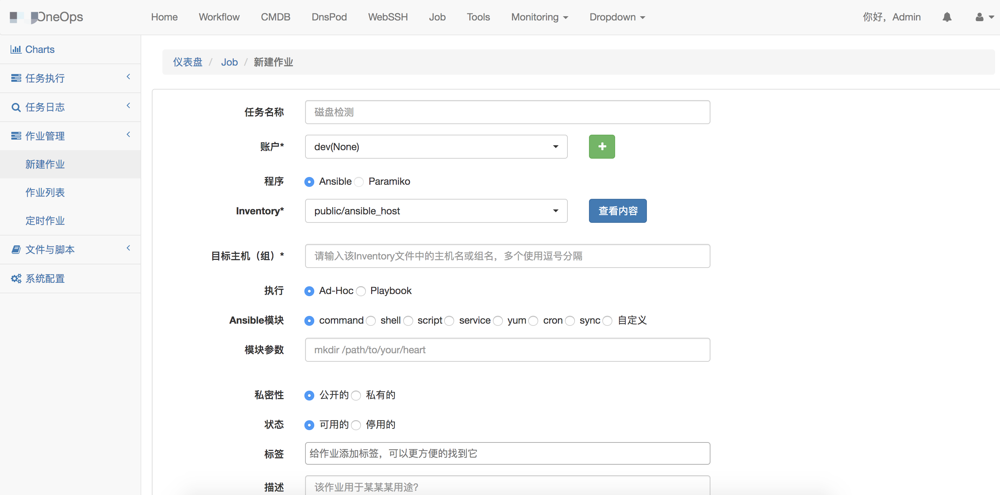

# oneops
集cmdb、运维工单、ansible、dns的统一运维平台。

## 子系统
### CMDB
1. 部门（业务）树、应用树
2. idc、机柜、vlan、网段、ip、资产树、网络设备管理、维保记录
3. 服务器及网络设备配件管理（自主维保）
4. 服务器按部门、资源、数量变化、机房、环境、厂家等可视化
5. vmware/kvm/centos/ubuntu主机信息及业务信息采集、ip/mac/应用采集、监控

---
特别说明：

1. 关于IP、网段、vlan、idc：

	虽然不同idc，vlan可重复。不同vlan，网段可重复。但本系统强制要求，同一idc内，不同vlan，网段也不要重复。-.-!

2. 关于服务器表里的IP
	1. 服务器表里login_address,manage_address可在web界面编辑。但并不代表是服务器上真实存在的ip，譬如微软云等使用外网ip+port端口映射作为login_address等情况。manage_address指IDRAC卡或ipmitool地址。
	2. ip跟网卡绑定，网卡跟服务器绑定。服务器的ip，暂时不让手动编辑，只能由agent脚本采集上传。

### Workflow（运维工单系统）
1. 流程步骤管理、流程可视化 
2. 应用申请、db权限、上线、下线自动化 
3. 阿里云、微软云oss上传，cdn刷新 
4. 跨网段访问申请 
5. tomcat jstack、在线dump

### DNSPOD
1. 基于BIND-DLZ + MySQL
	
	分为五个环境，分别为正式、beta、预发、测试、开发。同一域名在不同环境解析到不同的地址，所以配置了5个不同的数据库。
2. 尚未对接DNSPOD、aliyun、godaddy等平台。可利用对方的api接口，直接管理。
	
	参考：https://github.com/itimor/django-oms.git

### Job（作业平台）
1. inventory、playbook、roles、scripts管理 
2. ad-hoc/playbook快速脚本执行、文件分发、文件下载
3. 快速脚本保存为作业后的作业管理、定时作业
4. 执行历史记录

## 第三方软件
### 前端组件
- 主题 [sb-admin-2](https://github.com/BlackrockDigital/startbootstrap-sb-admin-2)
- 菜单栏 [metisMenu](https://github.com/onokumus/metismenu)
- 编辑器 [ace](https://github.com/ajaxorg/ace)
- 表格  [bootstrap-table](https://github.com/wenzhixin/bootstrap-table)
- 表格编辑  [bootstrap-editable](https://github.com/vitalets/x-editable)
- 下拉菜单 [bootstrap-select](https://github.com/snapappointments/bootstrap-select)
- 侧边栏 [bootsidemenu]()
- 文件上传 [bootstrap-fileinput]()
- 可视化 [echarts](https://www.echartsjs.com)
- web弹层 [layer](layer.layui.com/)
- jquery树 [zTree_v3]()
- jquery通知插件 [toastr](https://github.com/CodeSeven/toastr) [SweetAlert](https://sweetalert.bootcss.com/)

### 后端组件
- celery
- ansible
- paramiko
- daphne
- etc

